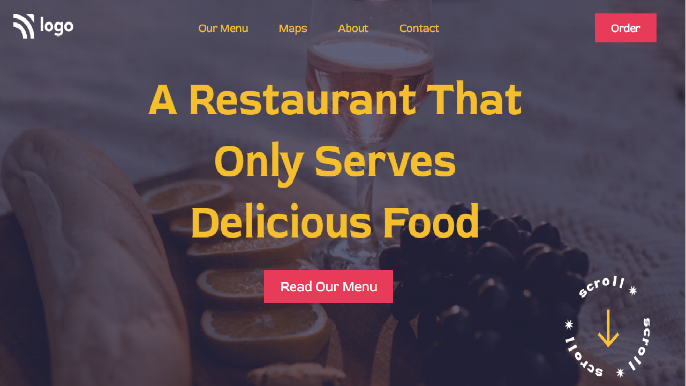

# Live Project 02

## Concepts learnt 
- setting background images
- how to use linear gradient to set background

To finish this project, I have taken 4 hours. 
Fully 1 hour for searching and fixing the back ground

[netlify link](https://food-service-landingpage.netlify.app/)

